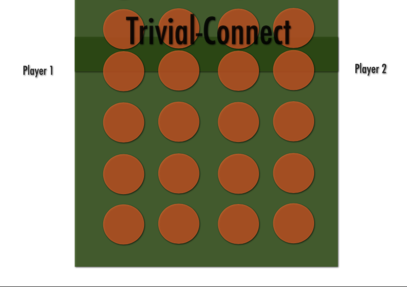
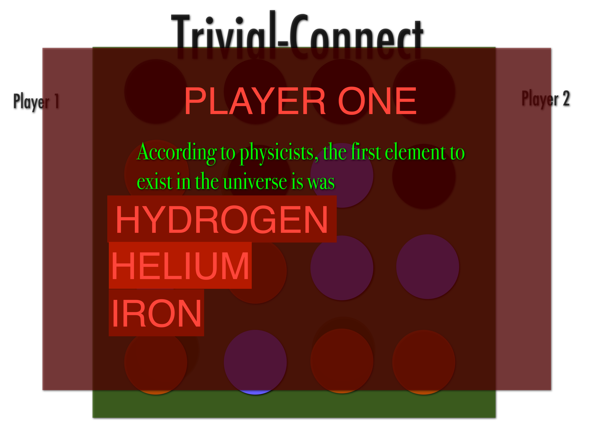
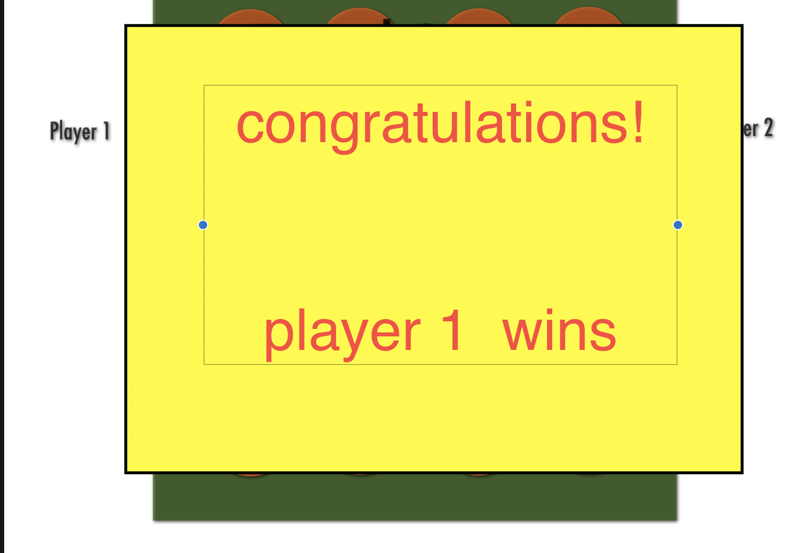

# trivia-connect

 

## Once your game starts you are prompted with a trivia question    

## once you answer (assuming it is correct)
## you proceed to your turn by clicking the desired row
## otherwise, yoor turn skips and the next player takes their turn
 

## once one of the players has made a row of four the screen pops up with a congrats modal
