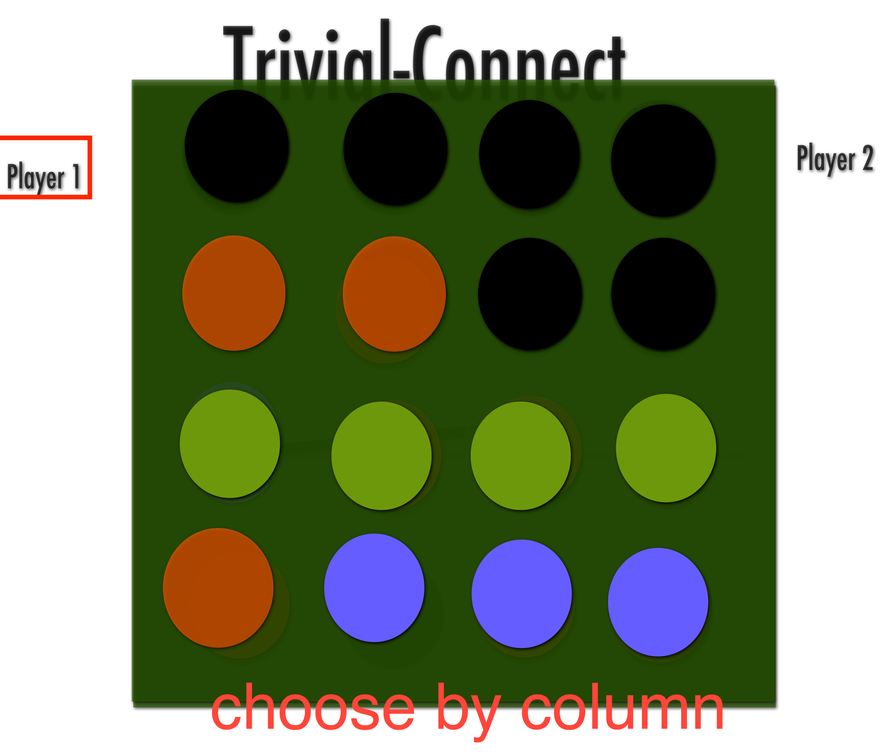
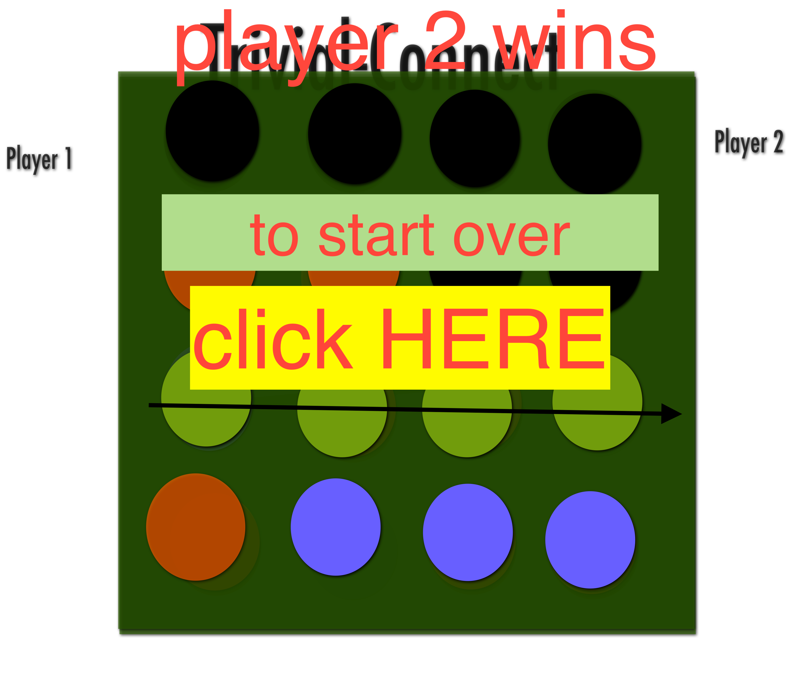

# trivia-connect

 

## Once your game starts you are prompted with a multiple choice trivia question   
 

## once you answer (assuming it is correct) you proceed to your turn by clicking the desired column
 

## otherwise, yoor turn skips and the next player takes their turn

## player 2 then takes their turn

## once one of the players has made a row of four the screen pops up with a congrats modal
