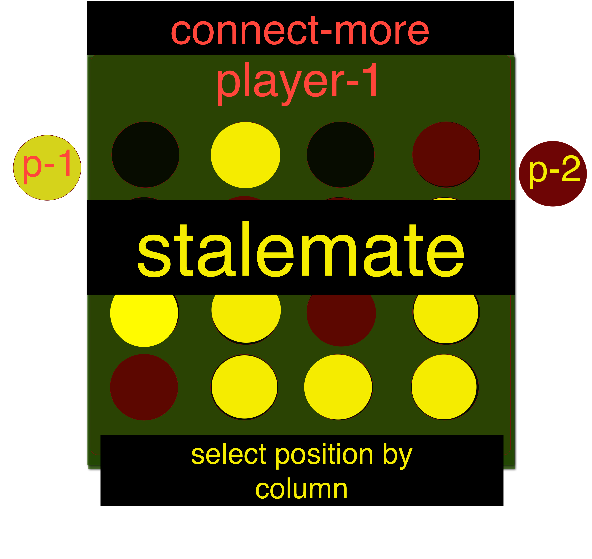
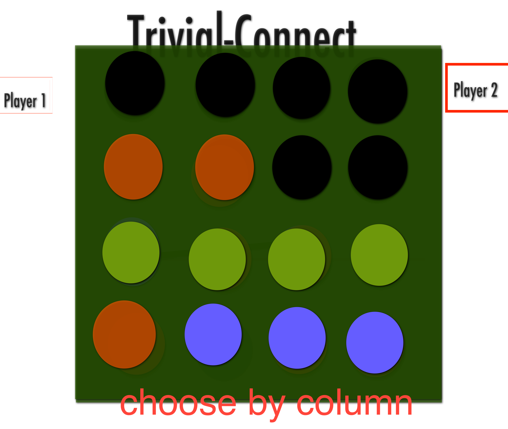

# **** TRIVIAL-CONNECT

## using a quiz api to interfere with each turn

### applying a conditional statement to only allow a turn upon answering the quiz question correctly

### I believe this will make connect four a good game

#### ...for once

  |    |
-----------------------|------------------------|
      |   |
-----------------------|------------------------|

### later I think applying an option to toggle the restricted turns for an "easy mode" would be good

### perhaps also a record of wins, losses and other stats per game player would add a nice touch

### additionally I am considering an option to modify the row/column amount for longer or shorter game configuration
