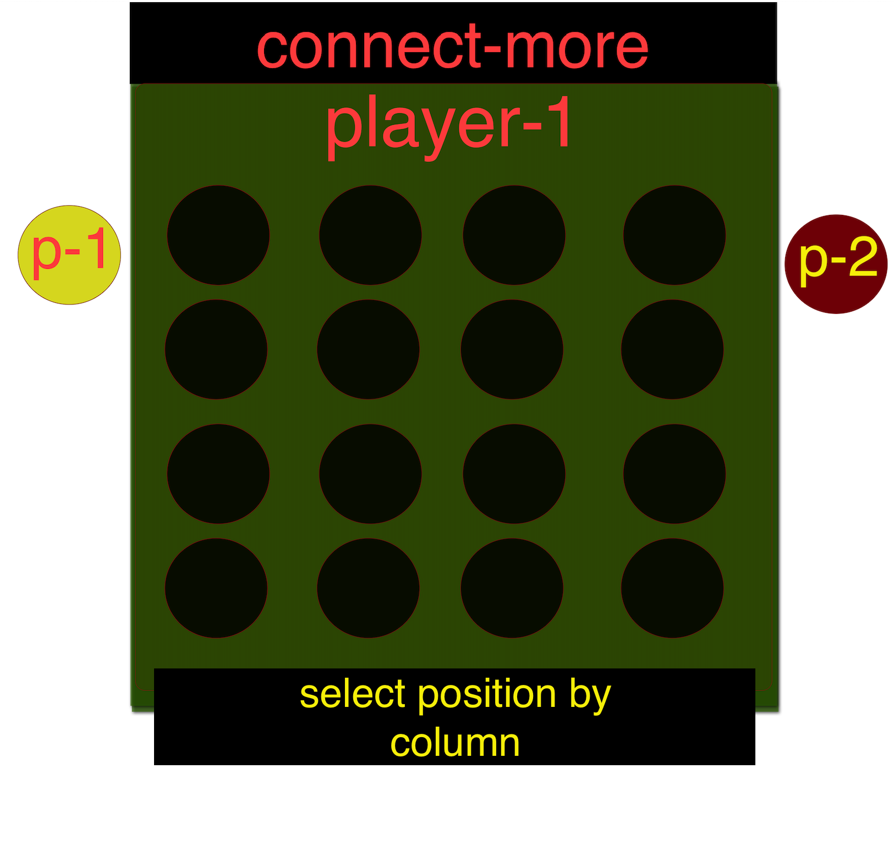

# Trivia-Connect

## user prompted

|  |  |
| -------------------------------------- | -------------------------------- |

### player takes their turn | after a back and forth of turns

### ...if it's a tie

### if I have time

### applying a conditional statement to only allow a turn upon answering the quiz question correctly

### I ca do this with the quizApi.io

### later I think applying an option to toggle the restricted turns for an "easy mode" would be good

### perhaps also a record of wins, losses and other stats per game player would add a nice touch

### additionally I am considering an option to modify the row/column amount for longer or shorter game configuration
